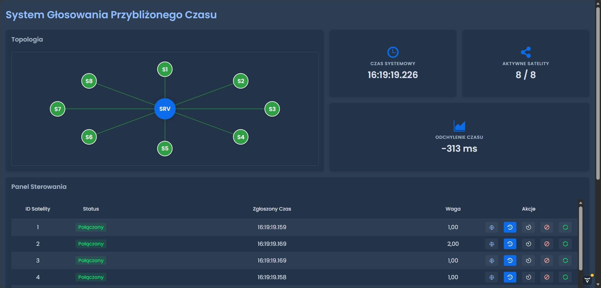

# System Głosowania Przybliżonego Czasu

System rozproszony do synchronizacji czasu oparty na algorytmie głosowania ważonego. Symuluje infrastrukturę 8 satelitów komunikujących się z serwerem centralnym przez TCP, z możliwością wstrzykiwania błędów i monitorowania w czasie rzeczywistym.



## Struktura projektu

```
src/main/java/pl/zapala/projekt/
├── ProjektApplication.java          # Główna klasa aplikacji
├── AppShell.java                    # Konfiguracja Vaadin
│
├── model/
│   └── VotingHistoryEntry.java      # DTO historii głosowań
│
├── protocol/
│   └── SatelliteProtocol.java       # Definicje protokołu TCP
│
├── satellite/
│   └── SatelliteApp.java            # Aplikacja satelity
│
├── service/
│   ├── ProcessLauncher.java         # Launcher satelitów
│   ├── TcpServerService.java        # Serwer TCP
│   └── VotingService.java           # Logika głosowania
│
└── view/
    └── DashboardView.java           # Interfejs użytkownika
```

## Funkcjonalności

### Panel główny

- **Czas systemowy** - obliczony czas na podstawie głosowania
- **Odchylenie** - różnica między obliczonym czasem a czasem rzeczywistym
- **Aktywne satelity** - liczba satelitów odpowiadających na zapytania

### Wizualizacja topologii

- Graficzna reprezentacja sieci (serwer + 8 satelitów)
- Kodowanie kolorami:
  - 🟢 **Zielony** - satelita aktywny (waga > 0)
  - 🟠 **Pomarańczowy** - satelita z wagą 0 (auto-ban)
  - 🔴 **Czerwony** - satelita rozłączony lub uszkodzony

### Panel sterowania satelitami

Dla każdego satelity dostępne są akcje:

| Akcja | Opis |
|-------|-------|
| **Waga** | Ustaw wagę satelity (0-10) |
| **Przesunięcie czasu** | Wstrzyknij błąd offsetu czasowego |
| **Opóźnienie sieci** | Symuluj opóźnienie komunikacji |
| **Awaria** | Zasymuluj awarię sprzętową |
| **Reset** | Przywróć domyślny stan |

### Historia głosowań

Tabela ostatnich 50 cykli głosowania z informacjami:
- Czas systemowy (HH:mm:ss.SSS)
- Liczba aktywnych satelitów
- Odchylenie od czasu rzeczywistego

## Technologie

### Backend
- **Java 21** - język programowania
- **Spring Boot 3.5.8** - framework aplikacyjny
- **Jackson** - serializacja JSON
- **Lombok** - redukcja boilerplate'u

### Frontend
- **Vaadin 24.9.7** - framework UI
- **Lumo Dark Theme** - motyw ciemny
- **SVG** - wizualizacja topologii
- **WebSocket** - push updates

### Komunikacja
- **TCP Sockets** - protokół komunikacji serwer-satelity
- **JSON** - format wymiany danych

## Instalacja i uruchomienie

### 1. Klonowanie repozytorium

```bash
git clone https://github.com/kubazap/Glosowanie_przyblizone
cd Glosowanie_przyblizone
```

### 2. Kompilacja projektu

```bash
mvn clean install
```

### 3. Uruchomienie aplikacji

```bash
mvn spring-boot:run
```

Aplikacja automatycznie:
- Uruchomi serwer HTTP na porcie **8080**
- Uruchomi serwer TCP na porcie **9000**
- Wystartuje 8 procesów satelitów
- Otworzy przeglądarkę z dashboardem

### 4. Dostęp do aplikacji

Otwórz przeglądarkę i przejdź do:
```
http://localhost:8080
```

---
